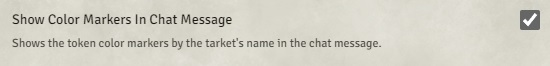
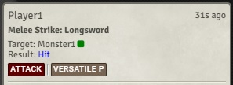

[](https://ko-fi.com/gundancer)

# Token Color Marker
This Foundry Virtual Tabletop module Adds a token HUD button to place a color marker for easy identification.

This module works for the "DnD5e", "Pathfinder", and "Pathfinder Second Edition" systems. It also works for the "worldbuilding" system so it may work for other systems not mentioned here.

## Installation

Module JSON:

```
https://github.com/Gundancer/foundryvtt-token-color-marker/releases/latest/download/module.json
```

## Usage
Token Color Marker works in a similar way to assigning a status effect. Open the color marker palette and select a color as shown below.


Remove a color marker by selecting it again from the color marker palette. Multiple color markers can be applied at once.


Token Color Marker comes with some module settings. The Token Color Marker button can be disabled, so it no longer shows on the token. The button can be set to only display for the GM. The GM can also create new and modify existing color markers.


The "My Color Settings" button in module settings will open the color customization window. The name of a color marker can be modified here along with the hex value. The color picker column shows the color and opens a color picker. The trash icon is used to delete. The "Add Color" button adds a new color marker with a random color. The image below is an example of adding "Pink" to the color marker palette.


## PF2e system Only
There is a setting to add the icon in the target section of the chat messages. this is only availible on pf2e system



In this example, Monster1 has the green token color marker active.


